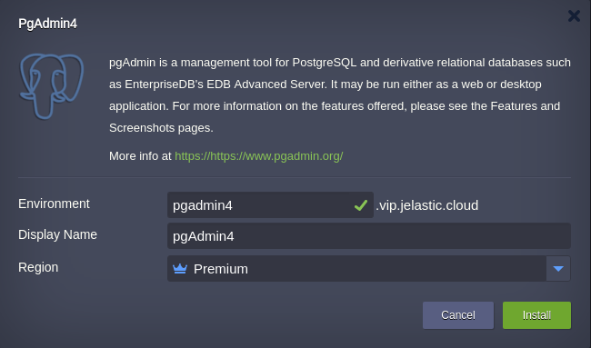
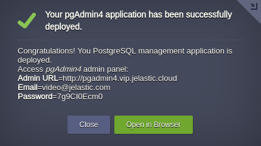
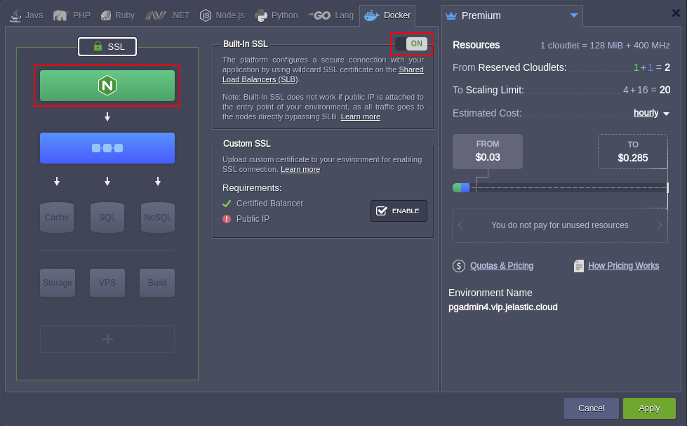

# pgAdmin4 

### The most popular and feature-rich Open Source administration and development platform for PostgreSQL.

**pgAdmin4** is an open source administration and development platform for PostgreSQL and its related database management systems. The platform is written in Python and jQuery and supports all PostgreSQL features. You can use pgAdmin for any operation, from writing basic SQL queries to monitoring your databases and setting up advanced database architectures.
 
## pgAdmin4 Deployment to the Cloud

Get your Jelastic account at any of available [hosting provider](https://jelastic.cloud/).

Click the **DEPLOY TO JELASTIC** button, specify your email address within the widget and press **Install**.

> **Note:** If you are already registered at Jelastic, you can deploy this application by importing the  [package manifest raw link](https://raw.githubusercontent.com/jelastic-jps/pgadmin/master/manifest.yaml) within the [dashboard](https://docs.jelastic.com/dashboard-guide).  
 
## Installation Process

In the opened confirmation window at Jelastic dashboard, if required change:  

* __Environment__ name  

* __Display Name__  

* destination __[Region](https://docs.jelastic.com/environment-regions)__ if several are available  

and click on __Install__.

 

Once the deployment is finished, you’ll see an appropriate success pop-up.

 

 The application is ready to use just press **Open in Browser** button and proceed to admin panel. Use provided credentials to access it.

## Traffic Encryption

For production mode, the installation will require a traffic encryption that can be ensured with the [Built-In SSL](https://docs.jelastic.com/built-in-ssl) certificate issued for certified load balancer which becomes an entry point of your environment. To do this add load balancer(e.g NGINX) to your environment and enable SSL.

 

